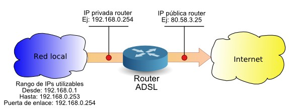
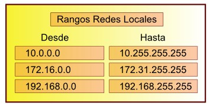
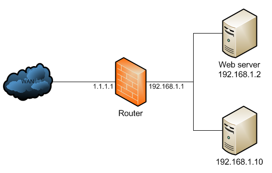

Repaso de redes
===============

Configuración TCP/IP
--------------------

La mayoría de personas ya saben que para que los PCs de una red puedan comunicarse entre sí, deben disponer de una dirección IP y de una máscara de subred. Además, si queremos que disponga de conexión a Internet, es necesario configurar la dirección IP de la puerta de enlace y la dirección IP de dos servidores DNS.

.. image:: img/repaso1.png

Dentro de una misma red, los PCs deben tener una dirección IP perteneciente al rango 
de dicha red. Si el rango es desde 192.168.0.0 hasta 192.168.0.255, las IPs de los PCs deberán tener los tres primeros números iguales (192.168.0.X) y el último número podrá cambiar desde 1 hasta 254, porque no se permite la utilización de la primera ni de la última dirección IP del rango ya que quedan reservadas.

Cada PC deberá tener una dirección IP diferente. Si dos PCs tienen la misma IP, habrá un conflicto de IP y ninguno de ellos podrá comunicarse hasta que no se resuelva el conflicto cambiando la IP a uno de ellos. Si no sabemos qué IP poner, podemos ver la IP de otro PC de nuestra red en el que funcione correctamente la conexión de Internet y por regla general, cambiar el último valor por otro diferente que no tenga ningún otro PC.

* La **Máscara de subred** determina el número de PCs del rango. Casi siempre se suele  utilizar la máscara 255.255.255.0 que corresponde a un rango de 256 direcciones IP (suficientes para casi todos los centros educativos) en los que todos los PCs tienen los tres primeros números de la IP iguales y solo cambia el último. Lo normal es que todos  los PCs de nuestra red tengan configurada la misma máscara de subred. Si no sabemos cual es la máscara de subred, podemos verla en otro PC que funcione correctamente la conexión de Internet.

* La **Puerta de enlace** deberá ser una IP del rango ya que de lo contrario, nuestro PC no será capaz de comunicarse con ella y no tendrá acceso a Internet. Lo normal es que todos los PCs de nuestra red tengan configurada la misma puerta de enlace. Si no sabemos la IP de nuestra puerta de enlace, podemos verla en otro PC que funcione correctamente la conexión de Internet.

* Los **DNS preferido y alternativo** nos los debe proporcionar la compañía que presta el servicio. Telefónica usa el 80.58.0.33 y el 80.58.32.97. Lo normal es que todos los PCs de nuestra red tengan configurados los mismos DNSs. Si no sabemos la IP de los DNS preferido y alternativo, podemos verlos en otro PC que funcione correctamente la conexión de Internet.

Direcciones IP públicas y privadas
----------------------------------

Las direcciones IP de los PCs de una red local son direcciones privadas ya que los PCs no están directamente conectados a Internet. Solamente el router dispone de conexión directa a Internet y por eso es el único que dispone de una dirección IP pública. 

Cuando los PCs de una misma red se quieren comunicar unos con otros, lo hacen directamente, pero si quieren comunicarse con Internet, deben hacerlo a través del router. Es equivalente a una centralita telefónica. Los teléfonos internos de una empresa utilizan números privados (extensiones) y las llamadas al exterior es necesario hacerlas a través de la centralita, que es la única que tiene números de teléfono públicos.

Los únicos rangos de direcciones que se pueden utilizar en redes locales son:

Estos rangos de direcciones no están asignados a direcciones públicas de Internet, sino que se han reservado para ser utilizados en las redes locales. Si en lugar de configurar nuestra red con estas direcciones utilizamos otro rango, como seguramente sea un rango utilizado por servidores de Internet, no tendremos acceso a dichos servidores.

NAT: Traducción de Direcciones de Red
-------------------------------------

La idea básica que hay detrás de NAT es traducir las IPs privadas de la red en una IP publica para que la red pueda enviar paquetes al exterior; y traducir luego esa IP publica, de nuevo a la IP privada del pc que envió el paquete, para que pueda recibirlo una vez llega la respuesta. Con un ejemplo lo veremos mejor.

Imaginemos que tenemos nuestra siguiente red:

Podría ser la típica red casera en la que tenemos un par de PCs que salen a Internet a través del router. Cada PC tiene asignada una IP privada, y el router tiene su IP privada (puerta de enlace) y su IP pública (que es nuestra IP de Internet).

Cuando uno de los PCs de la red local quiere enviar un paquete a Internet, se lo envía al router (o a la puerta de enlace o gateway), y éste hace lo que se conoce como SNAT (Source­NAT) y cambia la dirección de origen por si IP pública. Así, el host remoto sabrá a qué IP pública ha de enviar sus paquetes. Cuando una respuesta o un paquete pertenecientes a esa conexión llegue al router, éste traducirá la dirección IP de destino del paquete (que ahora es la IP del router) y la cambiará por la dirección privada del host que corresponde, para hacer la entrega del paquete a la red local.