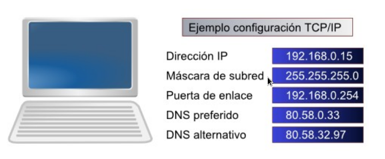

Repaso de redes
===============

Configuración TCP/IP
--------------------

La mayoría de personas ya saben que para que los PCs de una red puedan tercomunicarse entre sí, deben disponer de una dirección IP y de una máscara de subred. Además, si queremos que disponga de conexión a Internet, es necesario configurar la dirección IP de la puerta de enlace y la dirección IP de dos servidores DNS.

Dentro de una misma red, los PCs deben tener una dirección IP perteneciente al rango 
de dicha red. Si el rango es desde 192.168.0.0 hasta 192.168.0.255, las IPs de los PCs deberán tener los tres primeros números iguales (192.168.0.X) y el último número podrá cambiar desde 1 hasta 254, porque no se permite la utilización de la primera ni de la última dirección IP del rango ya que quedan reservadas.
