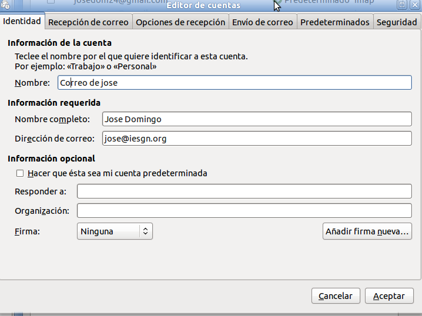
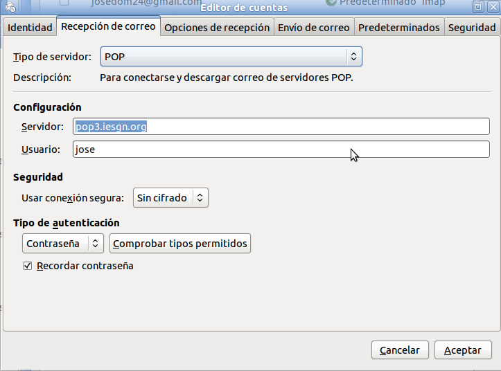
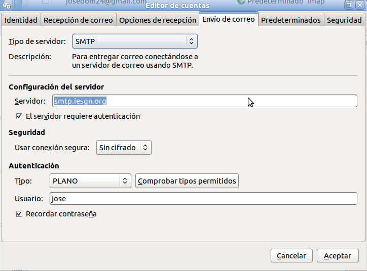

Ejercicio 2: Servidor POP y configuración de cliente de correo
==============================================================

En informática se utiliza el Post Office Protocol (POP3, Protocolo de la oficina de correo) en clientes locales de correo para obtener los mensajes de correo electrónico almacenados en un servidor remoto.

En nuestro caso el servidor pop3 que vamos a instalar se llama ``dovecot-pop3``, para instalarlo, simplemente::

    apt-get install dovecot-pop3d

**Configuración del servidor de correos postfrix**

Necesitamos configurar nuestro servidor de correo para permitir utilizar el servidor smtp desde otro ordenador de nuestra red local, para ello modificamos la siguiente línea en el fichero de configuración::

    mynetworks = 127.0.0.0/8 [::ffff:127.0.0.0]/104 [::1]/128 192.168.1.0/24

Ahora vamos a configurar postfix para que guarde los correos en un buzón del tipo ``Maildir``, para ello añadimos y modificamos las siguientes directivas de configuración::

    home_mailbox = Maildir/
    mailbox_command =

Una vez realizado el cambio reiniciamos el servicio::

    systemctl reload postfix

**Configuración del servidor pop3**

Cambiar en ``/etc/dovecot/conf.d/10-auth.conf``::

    #disable_plaintext_auth = yes    ->    disable_plaintext_auth = no

Para que este habilitada la autentificación con contraseña en claro.

Cambia en el fichero ``/etc/dovecot/conf.d/10-mail.conf``, donde se encuentra el buzón::

    #mail_location = mbox:~/mail:INBOX=/var/mail/%u
    mail_location = maildir:~/Maildir

Reiniciamos el servicio::

    systemctl restart dovecot

**Configuración del cliente de correo**

Es la hora de configurar un cliente de coreo desde nuestro cliente, en este ejemplo vamos a ver la configuración en evolution. Además tenemos que tener creados en el DNS de nuestro servidor los nombres ``pop3.dominio.com`` y ``smtp.dominio.com`` apuntando a la dirección del servidor (se pueden dar de alta usando un alias (CNAME)).

Creamos una nueva cuenta de correo con las siguientes características:

*Información de la cuenta*

*Servidor POP*

*Servidor SMTP*

.. warning::

    Siguiendo las indicaciones dadas anteriormente, instala el servidor POP3, y configura dos clientes de correos:

    * En el cliente Windows, configura el cliente de correos thunderbird con la cuenta ``jose@dominio.com``.
    En el cliente linux, configura el cliente de correos evolution con la cuenta ``maria@dominio.com``

    Debes configurar el dns del servidor para que se conozcan los nombres del servidor de correo (``smtp.dominio.com``) y el servidor POP (``pop3.dominio.com``).

    Realiza envíos de correos entre las dos usuarios.
