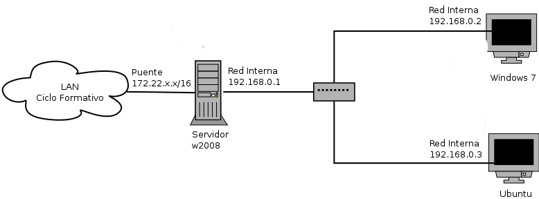

Tarea: Instalación del entorno de red
=====================================

Configuración de VirtualBox
---------------------------

Este es el esquema de red con el que queremos trabajar. Vamos a utilizar VirualBox para simular las máquinas que necesitamos en nuestro esquema de trabajo, de esta forma necesitaremos 3 máquinas virtuales:

* **Servidor Windows Server**: Donde instalaremos Windows 2008 server.

Las caracteristicas de esta máquina será:

    * RAM: 512 Mb
    * Disco duro:10 Gb
    * Dos tarjetas de red: Un **modo puente** y otra *Red Interna*.

* **Dos clientes**: uno instalado con un sistema operativo Windows y otro con Linux.

Las características de estas máquinas serán las siguientes:

    * RAM: 512 Mb
    * Disco duro:5 Gb
    * Una tarjeta de red en modo *Red Interna*.

.. warning::

    **Para entrega...**

    Entrega una captura de pantalla donde se vea la pantalla principal de VirtualBox con todas las características de la máquina que acabas de crear.

Instalación y configuración de los sistemas operativos
------------------------------------------------------

.. note::

    Antés de continuar con la instalación de las máquinas tenemos que decir que **nombres** vamos a utilizar para identificarlos.

Después de instalar los sistemas operativos, tienes que instalar las *"Guests Additions"*. A continución tenemos que configurar los siguientes parámetros:

1. El nombre de las máquinas: lo podemos hacer durante la instalación del sistema o después de la instalación, para ello en el sistema Windows:

    Inicio -> Botón derecho en Equipo -> Propiedades -> Cambiar configuración -> Cambiar ...

En el sistema Linux, modificamos el archivo ``/etc/hostname``.

2. Para que no tengamos problemas de conectividades vamos a desconectar el cortafuego del windows Server, para ello:

    Inicio -> Herramientas administrativas -> Firewall de Windows con seguridad avanzada -> Y desactivamos los tres perfiles (dominio, privado, público),.

3. Configuración de las interfaces de red.

* En el **Windows Server**:
    * La primera tarjeta la configuramos de forma dinamica en modo automática.
    * La segunda tarjeta la configuramos con estas caracteristicas:::

        Dirección IP: 192.168.0.1
        Mascara de red: 255.255.255.0

* En los clintes

    La interfaz de red la configuramos de forma estática:::nfiguración:

        IP: 192.168.0.2 (Windows) - 192.168.0.3 (Linux)
        Máscara: 255.255.255.0
        Puerta de enlace: 192.168.0.1
        Dns: 192.168.102.2

6) En el cliente Linux configuramos el nombre que hemos decidido.

7) El cliente linux tiene una tarjeta de red, configurada en modo 'Red Interna' que debes configurar de forma estática, con la siguiente configuración:

IP: 192.168.0.3
Máscara: 255.255.255.0
Puerta de enlace: 192.168.0.1
Dns: 8.8.8.8

8) Para terminar tenemos que hacer que el servidor Windows Server tenga la función de router y haga NAT, para que todas las peticiones que vengan por la "red Interna" sea enrutada por la tarjeta de red "Puente" y de esta manera los clientes sean capaz de salir a internet.

Para ello hay que seguir los siguientes pasos:

1. Incio -> Herramientas administrativas -> Administrador del servidor
2. Agregar roles -> Servicios de acceso y directiva de redes
3. En la pantalla servicios de rol escoge Enrutamiento -> Instalar
4. En administardor de servidor, en la ventana izquierda, desplegamo la pestañe de Roles, hasta que veamos Enrutamiento y acceso
5. Botón derecho -> Configurar y habilitar Enrutamiento y acceso remoto -> Traducción de direcciones de red (NAT) -> Siguiente -> Siguiente -> Configurar más adelante los servicios de nombres y direcciones

PRÁCTICA: INSTALACIÓN DE MÁQUINAS VIRTUALES

3) Instala Windows 2008 Server en la máquina que acabas de crear. 

Para entregar...

Entrega una captura de pantalla donde se vea una ventana Windows donde se este ejecutando la máquina virtual creada y la ejecución en una ventana de comandos (cmd) del comando ipconfig para que se vea la configuración de red.

4) Crea dos nuevas máquinas virtuales para los clientes, con las siguientes características:

    Los discos duros virtuales deben de ser de almacenamiento de expansión dinámica, de 15 Gb de capacidad.
    La configuración de la red está explicada en el documento: Esquema de red
    La memoria RAM vamos a asignarla a 512Mb
    El profesor aporta las imágenes ISO de los discos de instalación de los sistemas operativos.

Para entregar...

Entrega dos capturas de pantalla: una donde se vea el cliente Windows con una consola de texto con el comando ipconfig ejecutado, de esta manera podremos ver la configuración de red, otra donde se vea el cliente Linux con una consola de comando donde se vea ejecutado la instrucción ifconfig, para ver la configuración de red.

Entrega dos capturas de pantalla de los clientes donde se vea que están navegando por internet.